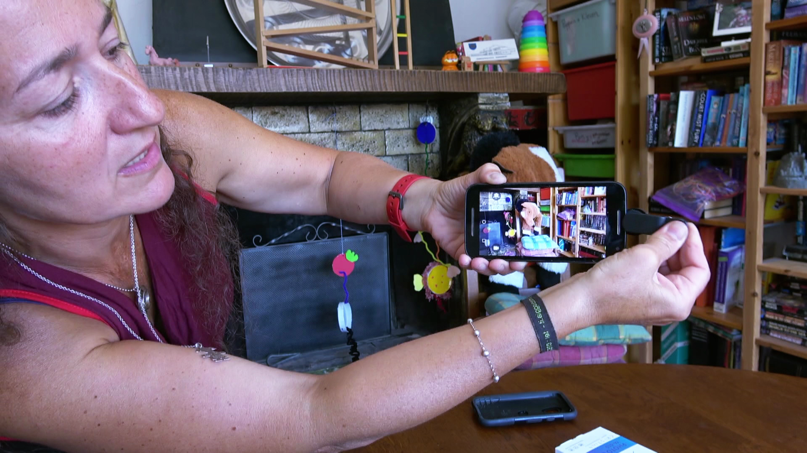
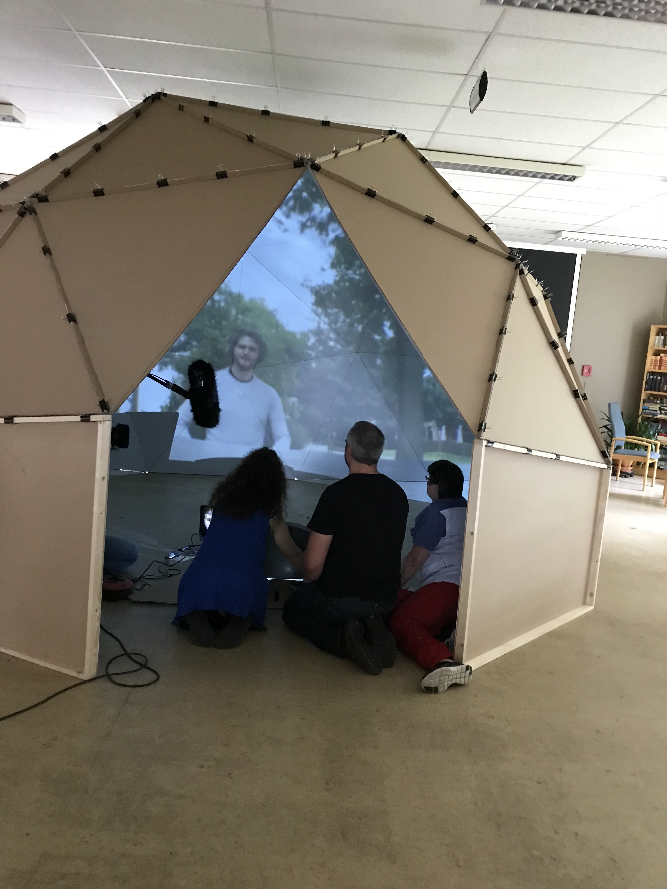

# Een 180° projectie in een dome

De oplossing voor het rusthuis een combinatie van verschillende technologieën en maker-projecten. De research en realisatie gebeurde door Maria-Cristina Ciocci en Geert Kockelbergh.

De oplossing bestaat uit drie onderdelen:

1. Een fish-eye lens voor je smartphone/tablet/laptop
2. Een short-throw beamer en bolle spiegel
3. Een dome waarin je deze beelden projecteert

## Fish-eye lens

Dit is een goedkoop opzet-lensje wat je kan vastklikken op je smartphone. [Deze lens](https://www.amazon.de/Yarrashop-handy-objektive-phone-Weitwinkelobjektiv-upgrade-Schwarz/dp/B01MDLZJM4) is gebruikt (hier zit zelfs ook nog een macrolens bij ook). Deze lens zorgt ervoor dat er een breder beeld opgenomen wordt.

Als je er een ander gebruikt, zorg dan zeker dat het een 180° fish-eye lens is.

### Voorbeeldfilmpje:

## Beamer

De beamer die gebruikt werd, is een BenQ TH682ST beamer. Belangrijk voor de beamer is dat het een short-throw projector is. Dit wil zeggen dat hij op een zeer korte afstand kan projecteren. Dit is nodig omdat anders het beeld heel onscherp wordt als het op de spiegel geprojecteerd wordt.

## Bolle spiegel

Een bolle spiegel wordt gebruikt voor de veiligheid in magazijnen en kan je bijvoorbeeld vinden op [www.itminterma.be](https://www.itminterma.be/veiligheid/spiegels-veiligheid/bolspiegels/halve-bolspiegel). We gebruikten die van 60cm.

## Dome: de koepel waarop geprojecteerd wordt

Geert en Maria-Cristina bouwden een dome en baseerde zich op de maximale hoogte van de ruimte in het RVT. Onderaan staan er referenties waarop deze plannen gebaseerd zijn.

De dome wordt volgens de opgegeven maten exact 5 meter breed en (met sokkel) 3.20 meter hoog

### Sokkel

De sokkel is schuin. Hierdoor krijg je een betere projectie voor je gezichtsveld, anders moet je teveel omhoog kijken. Ook heb je hierdoor een mogelijke ingang.

De sokkel maak je best uit mdf (6mm) en als randen gebruik je bv pannelatten of plafondlatten. Houd er rekening mee dat je klemmen groot genoeg moeten zijn om ook dit te kunnen klemmen.

### Driehoeken van karton

Je hebt 40 driehoeken (30 B en 10 A) nodig. Maak er steeds enkele meer, het gebeurt wel eens dat een driehoek plooit of scheurt.

Op basis van de afmetingen hebben we twee mallen gemaakt om op karton alles af te tekenen en te snijden.

De flappen aan de zijkanten van de driehoeken zijn 3 centimeter breed, waardoor de papierklemmen beter en dichter bij de plooi konden knijpen. De constructie is hierdoor sterker.

Maak eerst twee driehoeken in multiplex (6mm), mét de flappen erbij. Dit gebruik je als snijmal. Je kan met een scherp mes verschillende lagen karton snijden.

Met een lat/plank/rei maak je vervolgens de inkeping voor de plooi
Het maken van de plooi in het karton is best met een ietwat bot object, in ons geval een pizzasnijder. Het kan ook met een gewoon smeermes zonder tandjes.

### Opbouw

Je hebt zeker 200 klemmen nodig om voldoende klemmen te kunnen plaatsen, wij gebruikten er ongeveer 240. (zo kan je hier en daar wat meer klemmen plaatsen).

Het opbouwen zelf doe je van boven naar beneden. 

Je begint met de top vijfhoek (5 x B), daarna zet je er de eerste vijf gelijkzijdige driehoeken aan (A), dan weer de volgende gelijkbenige driehoeken (B) ertussen, dit kan eventueel al meteen als vijfhoek vastgezet (5xB).

Belangrijk: zorg voor genoeg volk, het karton is niet stevig genoeg om zelf te dragen zolang niet alle flappen aan elkaar vastzitten.

De klemmen plaats je zo dicht mogelijk tegen de hoeken (stevigheid en lichtlekken)

Tot slot maak je de sokkel (twee delen, het middelste stuk hoeft niet gemaakt, tenzij dit als deur moet dienen later) en draag je de dome met zeker een vijftal mensen op zijn plaats.

## Resultaat

### Referenties:

- [http://paulbourke.net/dome/](http://paulbourke.net/dome/)
- [http://www.instructables.com/id/Projection-Dome/](http://www.instructables.com/id/Projection-Dome/)
- [https://kriegerscience.wordpress.com/2010/08/02/how-to-make-a-planetarium/](https://kriegerscience.wordpress.com/2010/08/02/how-to-make-a-planetarium/)
- [http://www.cccoe.net/stars/5mdome.html](http://www.cccoe.net/stars/5mdome.html)
- [https://kriegerscience.wordpress.com/2010/08/02/how-to-make-a-planetarium/](https://kriegerscience.wordpress.com/2010/08/02/how-to-make-a-planetarium/)
- [http://www.worldwidetelescope.org/docs/worldwidetelescopeplanetarium.html#ToConstructaSmallerDome](http://www.worldwidetelescope.org/docs/worldwidetelescopeplanetarium.html#ToConstructaSmallerDome)
- [https://github.com/MonkeyGone2Heaven/SCNI_Toolbar/wiki/Virtual-Reality-Hemispheric-Dome](https://github.com/MonkeyGone2Heaven/SCNI_Toolbar/wiki/Virtual-Reality-Hemispheric-Dome)
- [http://www.domerama.com/](http://www.domerama.com/)